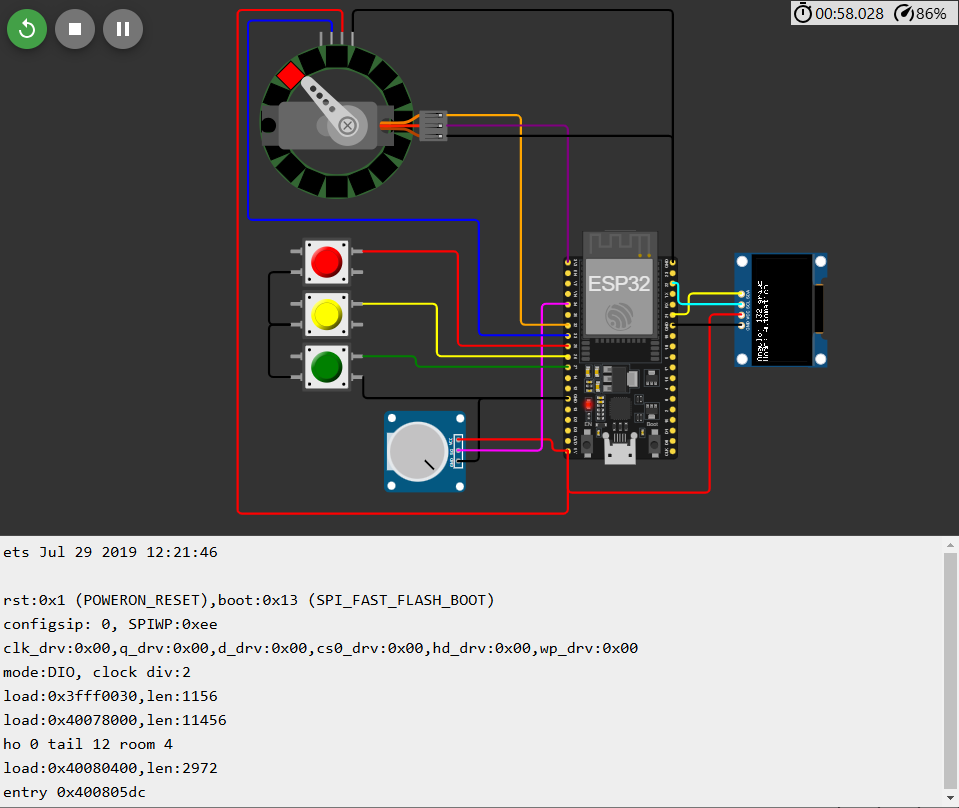
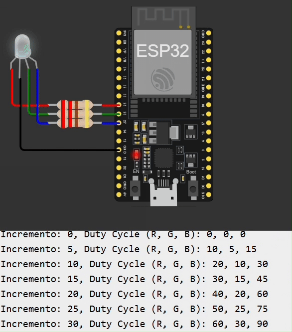

# Controle PWM e Comunicação com ESP32

## Integrantes
- André Jacob Suaide - **13864673**
- Henrique de Oliveira Araujo - **13863950**
- Oliver Kenzo Kobayashi - **13676930**
- Vítor Augusto Paiva de Brito - **13732303**

Este repositório contém a implementação de soluções práticas de controle PWM e comunicação serial utilizando o ESP32. O objetivo principal é desenvolver e documentar dois programas principais, cada um com requisitos e objetivos específicos, de forma a atender aos critérios de um projeto final de microcontroladores.

Cada programa está organizado em uma **pasta individual**, onde estão disponibilizados os seguintes itens:
- **Código fonte** (arquivo `.ino` e `.c`)
- **Imagens e prints** das simulações e testes realizados

---
# 📘 **Descrição dos Programas**

# 🔥 **Programa 1 - Controle do Servo Motor com Display OLED e LED Ring**
> **Local:** `/Programa1/`

Este programa utiliza a **plataforma Wokwi** e o **ESP32 com o framework Arduino IDE** para o controle de um **servo motor**, um **display OLED** e um **LED Ring Adafruit**. O objetivo é permitir o controle manual e automático do servo, além de indicar o ângulo do servo por meio de um **LED correspondente no LED Ring** e exibir informações no **display OLED**.

**🖥️ Demonstração do Projeto 1:**
> 

### 🧾 **Requisitos Implementados**
- **⚙️ Modo Automático**: 
  - O servo se move de **0° a 180°** e volta para **0°** de forma contínua.
  - Há um **delay de 1 segundo** nas posições de 0° e 180° antes de iniciar o movimento de retorno.
  - O movimento se repete de forma **contínua**.
  
- **🎚️ Modo Manual**: 
  - O servo é controlado diretamente pelo **potenciômetro**.
  - O ângulo do servo é proporcional ao valor lido no potenciômetro, permitindo o ajuste manual de forma intuitiva.

- **🎮 Controle via Botões**:
  - **Botão de Loop** (GPIO 27): Ativa o modo automático.
  - **Botão de Modo Manual** (GPIO 26): Ativa o modo manual.
  - **Botão de Parada** (GPIO 25): Interrompe o funcionamento do servo, parando qualquer movimento.

- **📟 Exibição no Display OLED**: 
  - O display mostra o **ângulo do servo** e o **modo de operação** em tempo real.
  - Exibição típica no OLED:
    ```
    Angulo: 45 graus
    Modo: Automático
    ```

- **💡 Controle de LED Ring Adafruit**: 
  - O **LED correspondente ao ângulo do servo** é ativado de acordo com o seguinte esquema:
    - **LED 0**: 0° a 20°
    - **LED 1**: 21° a 40°
    - **LED 2**: 41° a 60°
    - **LED 3**: 61° a 80°
    - **LED 4**: 81° a 100°
    - **LED 5**: 101° a 120°
    - **LED 6**: 121° a 140°
    - **LED 7**: 141° a 160°
    - **LED 8**: 161° a 180°
  - Apenas o LED correspondente ao intervalo de ângulo é aceso.

### ⚙️ **Componentes Utilizados**
- **Servo Motor**: Controlado via PWM com a biblioteca **ESP32Servo**.
- **Display OLED**: Comunicação via I2C com as bibliotecas **Adafruit GFX** e **Adafruit SSD1306**.
- **Potenciômetro**: Conectado ao GPIO **34** para controle manual.
- **Botões**: Conectados aos GPIOs **25, 26 e 27** para controle dos modos de operação.
- **LED Ring Adafruit**: LEDs que acendem conforme o ângulo do servo, com controle de cor e intensidade via a biblioteca **Adafruit NeoPixel**.

### 🛠️ **Conexões Físicas**
| **Componente**         | **Pino do ESP32** |
|---------------------|------------------|
| **Servo Motor**       | GPIO 32           |
| **Display OLED (SDA)**| GPIO 21           |
| **Display OLED (SCL)**| GPIO 22           |
| **Potenciômetro**     | GPIO 34 (ADC)     |
| **Botão Loop**        | GPIO 27           |
| **Botão Manual**      | GPIO 26           |
| **Botão Parada**      | GPIO 25           |
| **LED Ring**          | GPIO 33           |

---


# 🌈 **Programa 2 - Controle de LED RGB com PWM**
> **Local:** `/Programa2/`

O objetivo deste programa é controlar um **LED RGB** por meio de **modulação PWM (Pulse Width Modulation)** utilizando a **programação nativa ESP-IDF**. Este programa não utiliza o Arduino IDE e foi feito no ambiente **ESP-IDF**. O controle permite modificar o brilho de cada uma das cores RGB de forma individual.

## **Simulações**

No ***Wokwi***, foi construído e executado o circuito que faz o controle do LED RGB.
<p align="center">
  
</p>

Além disso, conforme a simulação apresentada a seguir, é possível verificar o funcionamento adequado do LED, de acordo com as especificações estabelecidas no projeto.

<p align="center">
  
</p>

## Explicação do Código

### Inclusão das bibliotecas
```C
#include <stdio.h>
#include "driver/ledc.h"
#include "freertos/FreeRTOS.h"
#include "freertos/task.h"
```
Inclusão da biblioteca `driver/ledc.h`  para controlar o PWM, utilizado para ajustar o brilho das cores do LED e das bibliotecas `freertos/FreeRTOS.h` e `freertos/task.h` para habilitar o gerenciamento de tarefas no FreeRTOS, que controla o ciclo principal de execução.

---

### Definições de Pinos e Configurações do PWM
```C
#define PINO_RED   25  // Pino GPIO para o LED Vermelho (R)
#define PINO_GREEN 26  // Pino GPIO para o LED Verde (G)
#define PINO_BLUE  27  // Pino GPIO para o LED Azul (B)

#define LEDC_TIMER           LEDC_TIMER_0           // Timer usado para o controle do PWM
#define LEDC_MODE            LEDC_LOW_SPEED_MODE    // Modo de velocidade baixa
#define LEDC_CHANNEL_RED     LEDC_CHANNEL_0         // Define o canal vermelho
#define LEDC_CHANNEL_GREEN   LEDC_CHANNEL_1         // Define o canal verde
#define LEDC_CHANNEL_BLUE    LEDC_CHANNEL_2         // Define o canal azul
#define LEDC_DUTY_RES        LEDC_TIMER_8_BIT       // Resolução de 8 bits (0-255)
#define LEDC_FREQUENCY       5000                   // Frequência de 5kHz
#define INCREMENTO           5                      // Incremento do duty cycle

```
Os pinos GPIO conectados às cores do LED vermelho, verde e azul são associados aos números `GPIO_NUM_25`, `GPIO_NUM_26` e `GPIO_NUM_27`, respectivamente. O timer utilizado para o PWM é o `LEDC_TIMER_0`, configurado para operar com a frequência de **5 kHz** e resolução de 8 bits, permitindo **256 níveis** de intensidade para cada cor. Também é definido o valor do incremento, que será usado para alterar progressivamente o brilho das cores do LED.

---

### Função de Configuração dos Canais PWM
```C
void configurar_pwm(ledc_channel_config_t *channel_config, int gpio_num, int channel) {
    channel_config->channel    = (ledc_channel_t)channel; 
    channel_config->duty       = 0;             // Duty cycle inicial
    channel_config->gpio_num   = gpio_num;
    channel_config->speed_mode = LEDC_MODE;
    channel_config->hpoint     = 0;
    channel_config->timer_sel  = LEDC_TIMER;
}
```
Este trecho define a função `configurar_pwm`, que configura um canal PWM (Pulse Width Modulation) utilizando a estrutura `ledc_channel_config_t`. Os parâmetros incluem o ponteiro `channel_config`, que aponta para a configuração do canal, o número do pino GPIO (`gpio_num`) e o número do canal (`channel`). A função inicializa o canal PWM especificando o ciclo de trabalho inicial (`duty`) como 0, o número do pino GPIO associado, o modo de velocidade (`speed_mode`), o ponto inicial (`hpoint`), e o temporizador usado (`timer_sel`).

---

### Tarefa para Controle de PWM
```C
void tarefa_pwm(void *pvParameters) {
    // Configuração dos três canais PWM (R, G, B)
    ledc_channel_config_t ledc_channel_red, ledc_channel_green, ledc_channel_blue;

    configurar_pwm(&ledc_channel_red, PINO_RED, LEDC_CHANNEL_RED);
    configurar_pwm(&ledc_channel_green, PINO_GREEN, LEDC_CHANNEL_GREEN);
    configurar_pwm(&ledc_channel_blue, PINO_BLUE, LEDC_CHANNEL_BLUE);

    ledc_channel_config(&ledc_channel_red);
    ledc_channel_config(&ledc_channel_green);
    ledc_channel_config(&ledc_channel_blue);
```
Inicialmente é configurado os três canais de PWM para controlar os pinos associados aos LEDs RGB. Cada canal é configurado individualmente, com parâmetros como pino GPIO e canal LEDC, e depois inicializado usando `ledc_channel_config`.

```C
    // Variáveis para controle de duty cycle
    int duty_red = 0;
    int duty_green = 0;
    int duty_blue = 0;
    int incremento = INCREMENTO;
    int contador = 0;
```
As variáveis `duty_red`, `duty_green` e `duty_blue` representam os valores de duty cycle **(0-255)** para os LEDs vermelho, verde e azul, respectivamente. A variável `incremento` é usada para modificar o duty cycle em cada iteração, e `contador` é um auxiliar para controlar as iterações e imprimir mensagens periodicamente.

```C
    while (1) {
        // Cálculo dos duty cycles para R, G e B
        duty_red = (incremento * 2) % 256; 
        duty_green = (incremento * 1) % 256;  
        duty_blue = (incremento * 3) % 256;
```
Dentro do loop infinito, os valores de duty cycle para os LEDs RGB são ajustados com base no incremento calculado, utilizando multiplicadores específicos para cada cor: 
- 2 para o vermelho.
- 1 para o verde.
- 3 para o azul.

```C
        // Atualização dos canais PWM
        ledc_set_duty(LEDC_MODE, LEDC_CHANNEL_RED, duty_red);
        ledc_update_duty(LEDC_MODE, LEDC_CHANNEL_RED);

        ledc_set_duty(LEDC_MODE, LEDC_CHANNEL_GREEN, duty_green);
        ledc_update_duty(LEDC_MODE, LEDC_CHANNEL_GREEN);

        ledc_set_duty(LEDC_MODE, LEDC_CHANNEL_BLUE, duty_blue);
        ledc_update_duty(LEDC_MODE, LEDC_CHANNEL_BLUE);
```
Após calcular os duty cycles, os valores são atualizados nos canais correspondentes usando as funções `ledc_set_duty` e `ledc_update_duty`. Isso garante que o sinal PWM aplicado aos LEDs reflete os valores calculados.

```C
        // Exibir o duty cycle no terminal a cada 5 loops
        if (contador % 1 == 0) {
            printf("Incremento: %d, Duty Cycle (R, G, B): %d, %d, %d\n", incremento, duty_red, duty_green, duty_blue);
        }
        
        // Atualizar o valor do incremento
        incremento += INCREMENTO;
        if (incremento > 255) {
            incremento = 0;         // Reseta o incremento
        }
```
Esse bloco exibe os valores de incremento e duty cycle no terminal para monitoramento. O incremento é atualizado a cada iteração, com reinicialização ao atingir o limite de 255, mantendo os valores dentro do intervalo válido de 8 bits.

```C
        // Delay de 0,1 segundo para liberar o processador
        vTaskDelay(50 / portTICK_PERIOD_MS);
        contador++;
```
O `vTaskDelay` insere um delay de 0,1 segundo na tarefa para reduzir o uso do processador e garantir que outras tarefas do sistema possam ser executadas. A variável `contador` é incrementada a cada iteração para controlar a frequência de exibição de mensagens.

---

### Função Principal (`app_main`)
```C
void app_main(void) {
    // Configuração do temporizador do PWM
    ledc_timer_config_t ledc_timer = {
        .speed_mode = LEDC_MODE,         
        .duty_resolution = LEDC_DUTY_RES, 
        .timer_num = LEDC_TIMER,          
        .freq_hz = LEDC_FREQUENCY,        
        .clk_cfg = LEDC_AUTO_CLK          
    };
    ledc_timer_config(&ledc_timer);

    // Criar a tarefa de controle de PWM
    xTaskCreate(tarefa_pwm, "Tarefa PWM", 2048, NULL, 1, NULL);
}
```
Por fim, é realizada a configuração do temporizador do LEDC, que define a resolução do duty cycle, a frequência do PWM, e o modo de operação. Essa configuração é necessária antes de inicializar os canais PWM.

A função principal cria uma tarefa **FreeRTOS** para o controle de PWM, permitindo que o código que ajusta os LEDs RGB seja executado em uma thread separada em `xTaskCreate`. A tarefa é criada com uma pilha de **2048 bytes** e prioridade baixa (1).

---

## 📚 **Referências**
- [Documentação da biblioteca Adafruit GFX](https://learn.adafruit.com/adafruit-gfx-graphics-library/overview)
- [Documentação da biblioteca Adafruit SSD1306](https://learn.adafruit.com/monochrome-oled-breakouts/overview)
- [Documentação ESP32Servo](https://github.com/PaulStoffregen/Servo)
- [Documentação do ESP-IDF](https://docs.espressif.com/projects/esp-idf/en/latest/esp32/)
